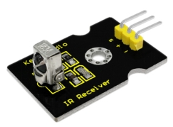
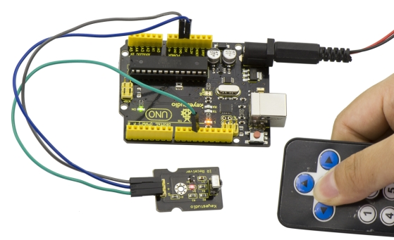

# KS0026 keyestudio Digital IR Receiver Module



## 1. Introduction

IR is widely used in remote control. With this IR receiver, Arduino project is able to receive command from any IR remoter controllers if you have right decoder. Well, it will be also easy to make your own IR controller using IR transmitter.

## 2. Specification

- Power Supply: 5V
- Interface: Digital
- Modulation Frequency: 38Khz

## 3. Connection Diagram

The following image shows a suggested connection method. You may use any Digital I/O pin that is not in use by another device. 


**NOTE:** In the sample code below Digital pin 11 is in use, you may either change your wiring or change the sample code to match.

## 4. Sample Code

Download Resources : [Resources](./Resources.7z)

Note： before uploading the code, you need to import the library files; otherwise, the code upload will fail.

```c
#include <IRremote.h>
int RECV_PIN = 11;
IRrecv irrecv(RECV_PIN);
decode_results results;

void setup()
{
  Serial.begin(9600);
  irrecv.enableIRIn(); // Start the receiver
}

void loop() 
{
  if (irrecv.decode(&results)) 
  {
    Serial.println(results.value, HEX);
    irrecv.resume(); // Receive the next value
  }
}
```

## 5. Result

Done wiring and uploading the code, then control the IR receiver module by an infrared remote control, D1 led will flash. Shown as below.


